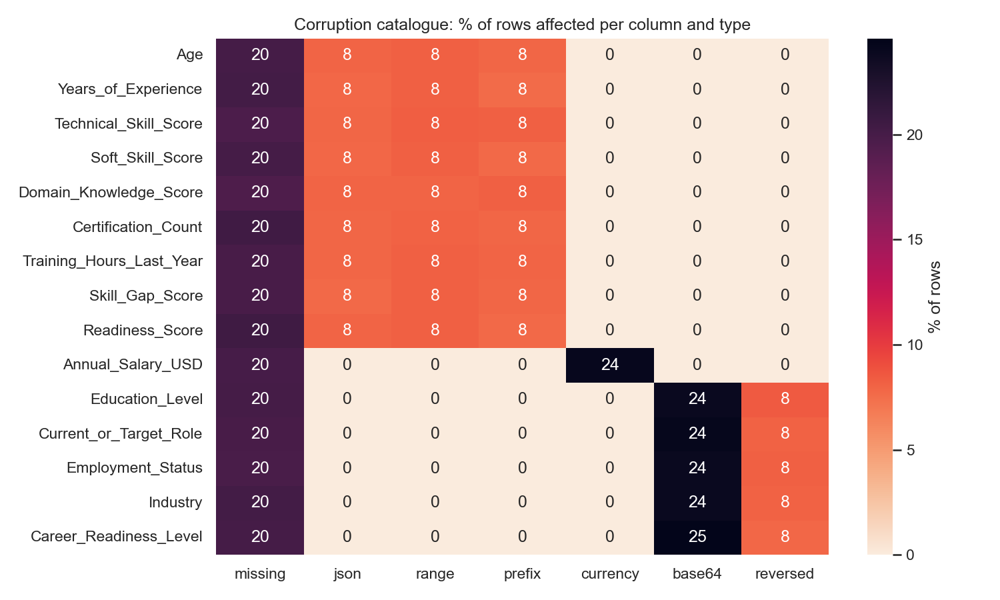
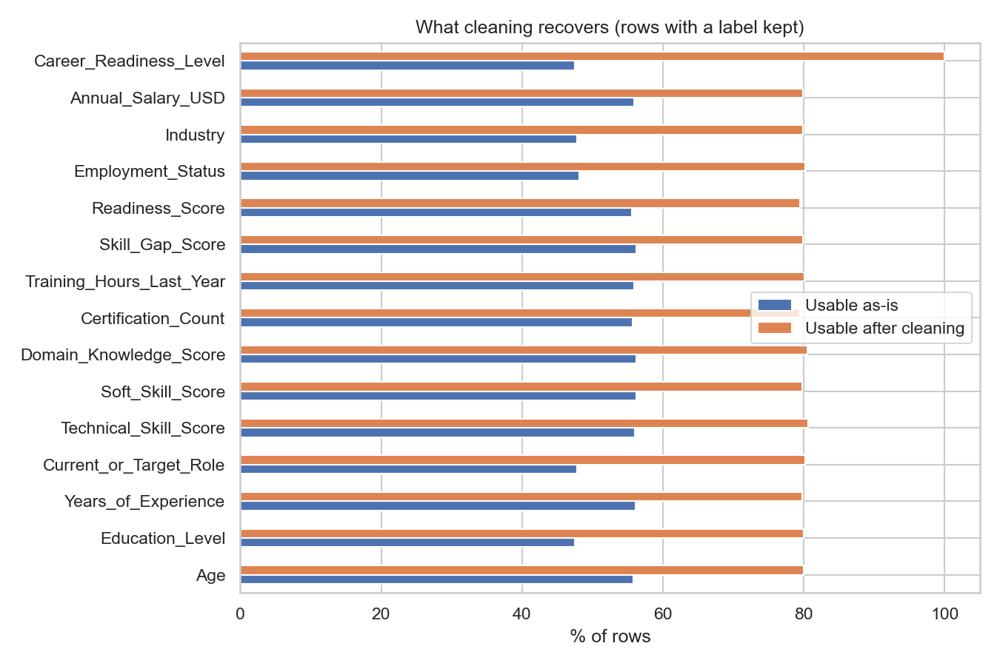
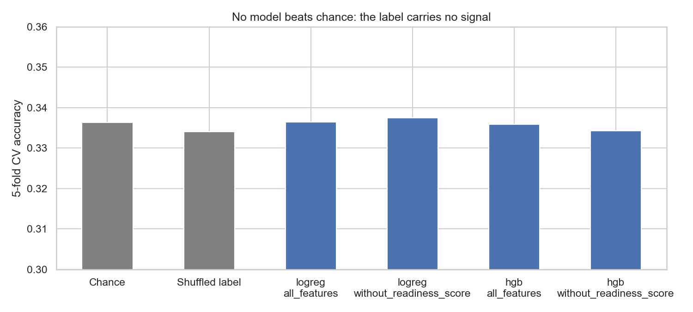
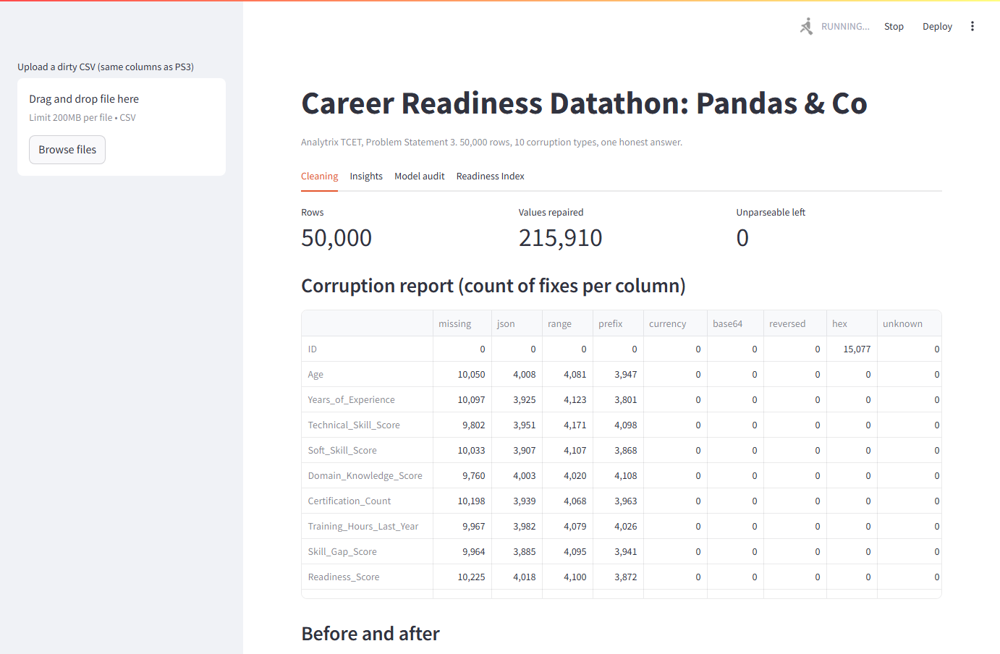
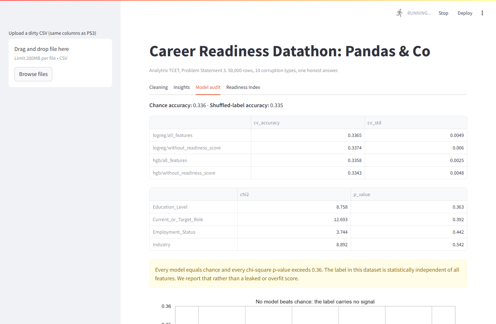

# Pandas & Co. — Career Readiness (Analytrix TCET, PS3)

50,000 career profiles, deliberately corrupted ten different ways, and a label
that turns out to carry no signal at all. We built a pipeline that repairs
every recoverable value, proved statistically that `Career_Readiness_Level`
cannot be predicted from this data, and shipped a transparent Readiness Index
instead of a fake accuracy number.



## The mess we were handed

| Corruption | Example | Rows hit | Fix |
|---|---|---|---|
| Five different missing tokens | `nan` `NULL` `MISSING` `?` `""` | ~20% per column | map to NaN |
| JSON-wrapped numbers | `{"v": 59}` | ~8% | extract `v` |
| Ranges instead of values | `51-56` | ~8% | midpoint |
| `Val_` prefix | `Val_52` | ~8% | strip |
| Currency noise | `118274 USD`, `$67508` | 24% of salary | strip |
| Base64 categoricals | `UmV0YWls` → Retail | ~24% | decode + match vocab |
| Reversed strings | `tsylanA ataD` → Data Analyst | ~8% | reverse + match vocab |
| Hex IDs | `0x1` | 30% | `int(x, 16)` |
| Corrupted label | `muideM`, `TWVkaXVt` | 32% | same fixes |
| Missing label | | 20% | drop (39,946 rows kept) |

After cleaning: **0 unparseable values** in any column. Every value is either
recovered or genuinely absent.



## The finding: the label is noise

We tried to predict `Career_Readiness_Level` honestly, and also tested for leakage.

| Model | 5-fold CV accuracy |
|---|---|
| Chance (majority class) | 0.336 |
| Logistic regression, all features | 0.337 |
| Gradient boosting, all features | 0.336 |
| Gradient boosting, without `Readiness_Score` | 0.334 |
| Gradient boosting on **shuffled** labels (20 runs) | 0.335 |

Chi-square tests of every categorical against the label: all p > 0.36.
Every numeric feature has |correlation| < 0.02 with every other feature.



The features are independent uniform draws and the label is a fair three-sided
coin. No model can beat 33 percent, and any submission claiming otherwise is
leaking or overfitting. We report this rather than hide it.

## What we ship instead

A transparent **Readiness Index** (0–100) built only from cleaned inputs:
40% skills average, 20% experience, 20% closed skill gap, 10% certifications,
10% training hours. It is explainable, tunable, and does not pretend to learn
from a random label.

## Demo app




## Presentation

`presentation.pptx` is the 8-slide pitch deck (charts embedded). `slides.md` is the speaker outline.

## Run it

```bash
pip install -r requirements.txt
python -m pytest -q                 # 5 tests on the cleaners
python -m src.preprocess            # corruption report + data/processed.csv
python -m src.train                 # model audit -> models/, reports/metrics.json
python -m src.charts                # reports/*.png
streamlit run app/app.py            # demo: upload dirty CSV, clean, audit, index
```

## Layout

```
src/preprocess.py   one function per corruption, clean(df) -> (df, report)
src/train.py        CV models, permutation test, chi-square, saves pipeline
src/charts.py       the seven story charts
app/app.py          Streamlit demo
tests/              assert-based tests for every cleaner
reports/            charts + metrics.json
data/raw/ps3.csv    the original dirty file
```
